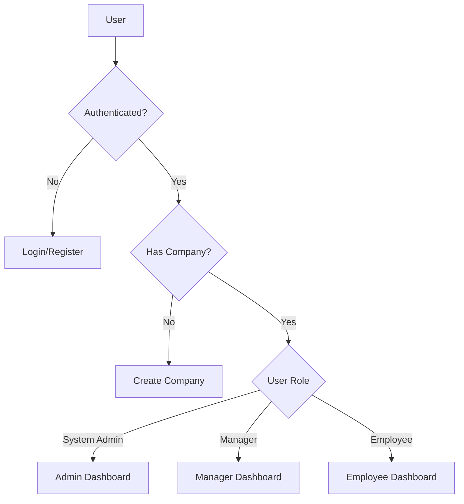

# ScaleFlow - SaaS Shift Scheduling & Management Platform

<div align="center">


[](https://www.typescriptlang.org/)
[](https://reactjs.org/)
[](https://vitejs.dev/)
[](https://tailwindcss.com/)
[](https://supabase.io/)

**A modern, role-based shift scheduling and workforce management solution**

[Features](#features) • [Getting Started](#getting-started) • [Architecture](#architecture) • [Roadmap](#roadmap) • [Contributing](#contributing)

</div>

---

## 📋 Table of Contents

- [Overview](#overview)
- [Features](#features)
- [Tech Stack](#tech-stack)
- [Getting Started](#getting-started)
- [Project Structure](#project-structure)
- [Architecture](#architecture)
- [User Roles](#user-roles)
- [Pages & Routes](#pages--routes)
- [Configuration](#configuration)
- [Development](#development)
- [Testing](#testing)
- [Deployment](#deployment)
- [Roadmap & Improvement Suggestions](#roadmap--improvement-suggestions)
- [Contributing](#contributing)
- [License](#license)

---

## 🌟 Overview

**ScaleFlow** is a comprehensive SaaS platform designed to streamline shift scheduling and workforce management for businesses of all sizes. Built with modern web technologies, it provides an intuitive interface for managers to create and manage schedules while giving employees visibility into their work assignments and the ability to manage preferences.

### Key Benefits

- ✅ **Role-based Access Control** - Different views and permissions for System Admins, Managers, and Employees
- ✅ **Real-time Updates** - Powered by Supabase for instant data synchronization
- ✅ **Responsive Design** - Works seamlessly on desktop and mobile devices
- ✅ **Modern UI/UX** - Built with shadcn/ui components for a consistent, accessible interface
- ✅ **Type-safe** - Full TypeScript support for better developer experience and fewer bugs

---

## ✨ Features

### For Managers
| Feature | Description |
|---------|-------------|
| 📅 **Schedule Management** | Create, edit, and delete shifts with detailed information |
| 👥 **Employee Management** | Invite, edit, and manage team members |
| 📋 **Shift Templates** | Create reusable templates for common shift patterns |
| ✅ **Preference Review** | Review and approve/reject employee work preferences |
| 🔄 **Swap Request Approval** | Manage shift swap requests between employees |
| ⚙️ **Company Settings** | Configure company-specific settings |

### For Employees
| Feature | Description |
|---------|-------------|
| 📅 **Personal Schedule** | View assigned shifts and upcoming work |
| 📝 **Preference Submission** | Submit availability and work preferences |
| 🔄 **Shift Swap Requests** | Request to swap shifts with colleagues |
| 👤 **Profile Management** | Update personal information and settings |

### For System Administrators
| Feature | Description |
|---------|-------------|
| 🏢 **Company Management** | Oversee all registered companies |
| 👥 **User Management** | Manage users across the platform |
| 📊 **Platform Analytics** | View total companies and users |

---

## 🛠 Tech Stack

### Frontend
- **[React 18](https://reactjs.org/)** - UI library
- **[TypeScript](https://www.typescriptlang.org/)** - Type-safe JavaScript
- **[Vite](https://vitejs.dev/)** - Build tool and development server
- **[React Router DOM](https://reactrouter.com/)** - Client-side routing
- **[TanStack Query](https://tanstack.com/query)** - Data fetching and caching

### Styling & UI
- **[Tailwind CSS](https://tailwindcss.com/)** - Utility-first CSS framework
- **[shadcn/ui](https://ui.shadcn.com/)** - Reusable component library
- **[Radix UI](https://www.radix-ui.com/)** - Accessible component primitives
- **[Lucide React](https://lucide.dev/)** - Icon library

### Backend & Authentication
- **[Supabase](https://supabase.io/)** - Backend-as-a-Service
  - PostgreSQL database
  - Authentication
  - Row-Level Security (RLS)
  - Real-time subscriptions

### Form Handling & Validation
- **[React Hook Form](https://react-hook-form.com/)** - Performant form handling
- **[Zod](https://zod.dev/)** - Schema validation

### Additional Libraries
- **[date-fns](https://date-fns.org/)** - Date manipulation
- **[Recharts](https://recharts.org/)** - Charting library
- **[Sonner](https://sonner.emilkowal.ski/)** - Toast notifications

---

## 🚀 Getting Started

### Prerequisites

- **Node.js** (v18 or higher recommended)
- **npm** or **pnpm** package manager
- **Supabase account** (for backend services)

### Installation

1. **Clone the repository**
   ```bash
   git clone https://github.com/Rafaelraas/ScaleFlow.git
   cd ScaleFlow
   ```

2. **Install dependencies**
   ```bash
   npm install
   # or
   pnpm install
   ```

3. **Configure environment variables**
   
   Create a `.env` file in the root directory:
   ```env
   VITE_SUPABASE_URL=your_supabase_project_url
   VITE_SUPABASE_ANON_KEY=your_supabase_anon_key
   ```

4. **Start the development server**
   ```bash
   npm run dev
   ```

5. **Open your browser**
   
   Navigate to `http://localhost:5173`

### Available Scripts

| Script | Description |
|--------|-------------|
| `npm run dev` | Start development server |
| `npm run build` | Build for production |
| `npm run build:dev` | Build for development |
| `npm run preview` | Preview production build |
| `npm run lint` | Run ESLint |
| `npm run test` | Run tests with Vitest |
| `npm run test:ui` | Run tests with UI |

---

## 📁 Project Structure

```
ScaleFlow/
├── public/                 # Static assets
├── src/
│   ├── components/         # Reusable components
│   │   ├── layout/        # Layout components (Navbar, Sidebar, Layout)
│   │   ├── ui/            # shadcn/ui components
│   │   └── ...            # Feature-specific components
│   ├── hooks/             # Custom React hooks
│   ├── integrations/      # External service integrations
│   │   └── supabase/      # Supabase client configuration
│   ├── lib/               # Utility functions
│   ├── pages/             # Page components
│   ├── providers/         # React context providers
│   ├── utils/             # Helper utilities
│   ├── App.tsx            # Main application component with routes
│   ├── main.tsx           # Application entry point
│   └── globals.css        # Global styles
├── .env                   # Environment variables (not committed)
├── tailwind.config.ts     # Tailwind CSS configuration
├── vite.config.ts         # Vite configuration
└── package.json           # Project dependencies
```

---

## 🏗 Architecture

### Application Flow



### State Management

- **Session Context** - Manages authentication state and user profile
- **TanStack Query** - Handles server state and caching
- **Local State** - Component-level state using React hooks

### Security

- **Row-Level Security (RLS)** - Database-level access control via Supabase
- **Role-based Access** - Route protection based on user roles
- **Protected Routes** - Client-side route guards

---

## 👤 User Roles

### System Admin (`system_admin`)
- Full platform access
- Manage all companies and users
- View platform-wide analytics

### Manager (`manager`)
- Company-level access
- Create and manage schedules
- Manage employees
- Approve preferences and swap requests

### Employee (`employee`)
- Personal access
- View assigned shifts
- Submit preferences
- Request shift swaps

---

## 📄 Pages & Routes

| Route | Component | Access | Description |
|-------|-----------|--------|-------------|
| `/` | `Index` | Public | Landing page |
| `/login` | `Login` | Public | User login |
| `/register` | `Register` | Public | User registration |
| `/verify` | `Verify` | Public | Email verification |
| `/dashboard` | `Dashboard` | Protected | Role-specific dashboard |
| `/schedules` | `Schedules` | Manager | Schedule management |
| `/shift-templates` | `ShiftTemplates` | Manager | Shift template management |
| `/employees` | `Employees` | Manager | Employee management |
| `/employee-preferences` | `EmployeePreferences` | Manager | Review employee preferences |
| `/my-schedule` | `MySchedule` | Employee | Personal schedule view |
| `/preferences` | `Preferences` | Employee | Submit work preferences |
| `/swap-requests` | `SwapRequests` | Protected | Manage shift swaps |
| `/profile-settings` | `ProfileSettings` | Protected | User profile settings |
| `/company-settings` | `CompanySettings` | Manager | Company configuration |
| `/create-company` | `CreateCompany` | Protected | Create new company |
| `/admin/companies` | `AdminCompanyManagement` | System Admin | Platform company management |
| `/admin/users` | `AdminUserManagement` | System Admin | Platform user management |

---

## ⚙️ Configuration

### Tailwind CSS

The project uses a custom Tailwind configuration with:
- Custom color palette for light/dark themes
- Typography plugin for prose content
- Animation utilities

### TypeScript

Multiple TypeScript configurations:
- `tsconfig.json` - Base configuration
- `tsconfig.app.json` - Application-specific settings
- `tsconfig.node.json` - Node.js environment settings

### ESLint

ESLint is configured with:
- TypeScript support
- React Hooks rules
- React Refresh plugin

---

## 💻 Development

### Code Style Guidelines

1. **Components** - Use functional components with TypeScript interfaces
2. **Styling** - Use Tailwind CSS utility classes
3. **State** - Prefer local state; use context for shared state
4. **Forms** - Use React Hook Form with Zod validation
5. **API Calls** - Handle errors gracefully with toast notifications

### Adding New Features

1. Create page component in `src/pages/`
2. Add route in `src/App.tsx`
3. Update `Sidebar.tsx` for navigation
4. Implement required forms/components
5. Add appropriate access control

---

## 🧪 Testing

The project uses **Vitest** for testing with:
- `@testing-library/react` for component testing
- `@testing-library/jest-dom` for DOM assertions

```bash
# Run all tests
npm run test

# Run tests with UI
npm run test:ui
```

---

## 🚢 Deployment

### Vercel (Recommended)

The project includes a `vercel.json` configuration for easy deployment:

1. Connect your repository to Vercel
2. Configure environment variables
3. Deploy automatically on push

### Manual Build

```bash
npm run build
```

The build output will be in the `dist/` directory.

---

## 🗺 Roadmap & Improvement Suggestions

### High Priority 🔴

- [x] **Add unit tests** - Increase test coverage for critical components ✅
- [x] **Implement error boundaries** - Better error handling and user feedback ✅
- [x] **Add loading states** - Consistent skeleton loaders across all pages ✅
- [x] **Implement pagination** - For large data sets (employees, shifts, etc.) ✅

### Medium Priority 🟡

- [x] **Dark mode toggle** - User preference for theme selection ✅
- [ ] **Calendar view** - Visual calendar for schedule management
- [ ] **Notifications system** - Real-time notifications for shift changes
- [ ] **Export functionality** - Export schedules to PDF/Excel
- [ ] **Bulk actions** - Select and modify multiple shifts at once
- [ ] **Internationalization (i18n)** - Multi-language support

### Low Priority 🟢

- [ ] **Analytics dashboard** - Detailed reports and insights
- [ ] **Mobile app** - React Native companion app
- [ ] **API documentation** - OpenAPI/Swagger documentation
- [ ] **Audit logs** - Track changes and user actions
- [ ] **Integration webhooks** - Connect with external systems

### Technical Debt 🔧

- [ ] **Fix TypeScript `any` types** - Replace with proper type definitions
- [x] **Add `jsdom` to devDependencies** - Fix test environment ✅
- [ ] **Code splitting** - Implement lazy loading for routes
- [ ] **Bundle size optimization** - Reduce main chunk size
- [ ] **Add Storybook** - Component documentation and testing

### Security Enhancements 🔐

- [ ] **Rate limiting** - Prevent abuse on API endpoints
- [ ] **Input sanitization** - Enhanced form validation
- [ ] **CORS configuration** - Proper cross-origin settings
- [ ] **Session timeout** - Auto-logout on inactivity

---

## 🤝 Contributing

Contributions are welcome! Please follow these steps:

1. Fork the repository
2. Create a feature branch (`git checkout -b feature/amazing-feature`)
3. Commit your changes (`git commit -m 'Add amazing feature'`)
4. Push to the branch (`git push origin feature/amazing-feature`)
5. Open a Pull Request

### Commit Message Convention

Use conventional commits:
- `feat:` - New feature
- `fix:` - Bug fix
- `docs:` - Documentation changes
- `style:` - Code style changes
- `refactor:` - Code refactoring
- `test:` - Test additions/modifications
- `chore:` - Maintenance tasks

---

## 📄 License

This project is licensed under the MIT License - see the [LICENSE](LICENSE) file for details.

---

<div align="center">

**Built with ❤️ using [Dyad](https://dyad.sh)**

[⬆ Back to Top](#scaleflow---saas-shift-scheduling--management-platform)

</div>
