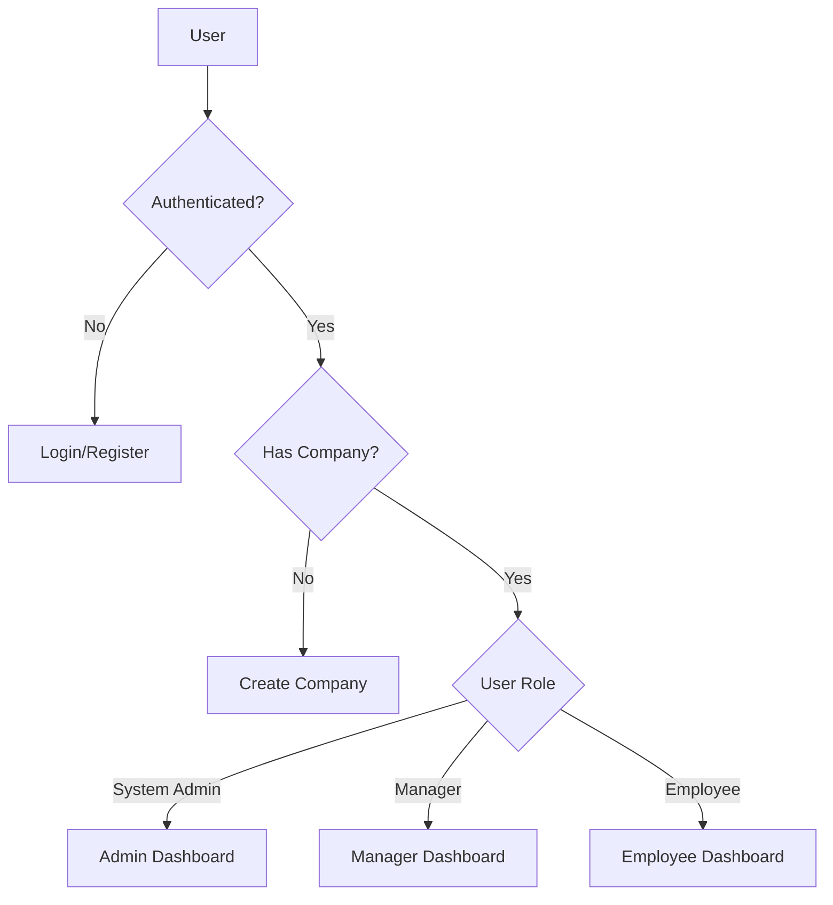

# ScaleFlow - SaaS Shift Scheduling & Management Platform

<div align="center">


[](https://www.typescriptlang.org/)
[](https://reactjs.org/)
[](https://vitejs.dev/)
[](https://tailwindcss.com/)
[](https://supabase.io/)

**A modern, role-based shift scheduling and workforce management solution**

[Features](#features) • [Getting Started](#getting-started) • [Documentation](#-documentation) • [Roadmap](#roadmap) • [Contributing](#contributing)

</div>

---

## 📋 Table of Contents

- [Overview](#overview)
- [Features](#features)
- [Tech Stack](#tech-stack)
- [Getting Started](#getting-started)
- [Documentation](#-documentation)
- [Project Structure](#project-structure)
- [Architecture](#architecture)
- [User Roles](#user-roles)
- [Pages & Routes](#pages--routes)
- [Configuration](#configuration)
- [Development](#development)
- [Testing](#testing)
- [Deployment](#deployment)
- [Roadmap & Improvement Suggestions](#roadmap--improvement-suggestions)
- [Contributing](#contributing)
- [License](#license)

---

## 🌟 Overview

**ScaleFlow** is a comprehensive SaaS platform designed to streamline shift scheduling and workforce management for businesses of all sizes. Built with modern web technologies, it provides an intuitive interface for managers to create and manage schedules while giving employees visibility into their work assignments and the ability to manage preferences.

### Key Benefits

- ✅ **Role-based Access Control** - Different views and permissions for System Admins, Managers, and Employees
- ✅ **Real-time Updates** - Powered by Supabase for instant data synchronization
- ✅ **Responsive Design** - Works seamlessly on desktop and mobile devices
- ✅ **Modern UI/UX** - Built with shadcn/ui components for a consistent, accessible interface
- ✅ **Type-safe** - Full TypeScript support for better developer experience and fewer bugs

---

## ✨ Features

### For Managers
| Feature | Description |
|---------|-------------|
| 📅 **Schedule Management** | Create, edit, and delete shifts with detailed information |
| 👥 **Employee Management** | Invite, edit, and manage team members |
| 📋 **Shift Templates** | Create reusable templates for common shift patterns |
| ✅ **Preference Review** | Review and approve/reject employee work preferences |
| 🔄 **Swap Request Approval** | Manage shift swap requests between employees |
| ⚙️ **Company Settings** | Configure company-specific settings |

### For Employees
| Feature | Description |
|---------|-------------|
| 📅 **Personal Schedule** | View assigned shifts and upcoming work |
| 📝 **Preference Submission** | Submit availability and work preferences |
| 🔄 **Shift Swap Requests** | Request to swap shifts with colleagues |
| 👤 **Profile Management** | Update personal information and settings |

### For System Administrators
| Feature | Description |
|---------|-------------|
| 🏢 **Company Management** | Oversee all registered companies |
| 👥 **User Management** | Manage users across the platform |
| 📊 **Platform Analytics** | View total companies and users |

---

## 🛠 Tech Stack

### Frontend
- **[React 18](https://reactjs.org/)** - UI library
- **[TypeScript](https://www.typescriptlang.org/)** - Type-safe JavaScript
- **[Vite](https://vitejs.dev/)** - Build tool and development server
- **[React Router DOM](https://reactrouter.com/)** - Client-side routing
- **[TanStack Query](https://tanstack.com/query)** - Data fetching and caching

### Styling & UI
- **[Tailwind CSS](https://tailwindcss.com/)** - Utility-first CSS framework
- **[shadcn/ui](https://ui.shadcn.com/)** - Reusable component library
- **[Radix UI](https://www.radix-ui.com/)** - Accessible component primitives
- **[Lucide React](https://lucide.dev/)** - Icon library

### Backend & Authentication
- **[Supabase](https://supabase.io/)** - Backend-as-a-Service
  - PostgreSQL database
  - Authentication
  - Row-Level Security (RLS)
  - Real-time subscriptions

### Form Handling & Validation
- **[React Hook Form](https://react-hook-form.com/)** - Performant form handling
- **[Zod](https://zod.dev/)** - Schema validation

### Additional Libraries
- **[date-fns](https://date-fns.org/)** - Date manipulation
- **[Recharts](https://recharts.org/)** - Charting library
- **[Sonner](https://sonner.emilkowal.ski/)** - Toast notifications

---

## 🚀 Getting Started

### Prerequisites

- **Node.js** (v18 or higher recommended)
- **npm** or **pnpm** package manager
- **Supabase account** (for backend services)

### Installation

1. **Clone the repository**
   ```bash
   git clone https://github.com/Rafaelraas/ScaleFlow.git
   cd ScaleFlow
   ```

2. **Install dependencies**
   ```bash
   npm install
   # or
   pnpm install
   ```

3. **Configure backend** (🆕 Automated Setup)
   
   Run the automated backend setup script:
   ```bash
   npm run backend:setup
   # or
   bash scripts/setup-backend.sh
   ```
   
   This will:
   - ✓ Install Supabase CLI locally
   - ✓ Create `.env` files from templates
   - ✓ Validate database migrations
   - ✓ Provide next steps for deployment
   
   **For detailed backend configuration**, see [BACKEND_SETUP.md](./BACKEND_SETUP.md)

4. **Configure environment variables**
   
   Edit the `.env` file created in step 3:
   ```env
   VITE_SUPABASE_URL=your_supabase_project_url
   VITE_SUPABASE_ANON_KEY=your_supabase_anon_key
   ```
   
   Get these values from [Supabase Dashboard](https://app.supabase.com/project/ttgntuaffrondfxybxmi/settings/api)

5. **Deploy database migrations**
   ```bash
   npm run backend:deploy
   # or
   cd supabase && bash deploy.sh production
   ```

6. **Start the development server**
   ```bash
   npm run dev
   ```

7. **Open your browser**
   
   Navigate to `http://localhost:5173`

### Available Scripts

#### Development Scripts
| Script | Description |
|--------|-------------|
| `npm run dev` | Start development server |
| `npm run build` | Build for production |
| `npm run build:dev` | Build for development |
| `npm run preview` | Preview production build |
| `npm run lint` | Run ESLint |
| `npm run test` | Run tests with Vitest |
| `npm run test:ui` | Run tests with UI |

#### Backend Scripts (🆕)
| Script | Description |
|--------|-------------|
| `npm run backend:setup` | Setup backend infrastructure |
| `npm run backend:deploy` | Deploy database migrations |
| `npm run backend:start` | Start local Supabase (requires Docker) |
| `npm run backend:stop` | Stop local Supabase |
| `npm run backend:status` | Check Supabase status |
| `npm run backend:link` | Link to Supabase project |

**Need help?** Check out the [Quick Start Guide](./QUICK_START.md) for a 5-minute setup tutorial.

---

## 📚 Documentation

Comprehensive documentation is available to help you understand and contribute to ScaleFlow:

### Core Documentation

| Document | Description |
|----------|-------------|
| [📖 Documentation Index](./docs/INDEX.md) | Complete documentation overview and navigation |
| [⚡ Quick Start Guide](./QUICK_START.md) | Get up and running in 5 minutes |
| [🔧 Backend Setup Guide](./BACKEND_SETUP.md) | **🆕 Complete backend configuration guide** |
| [🏗️ Architecture Guide](./docs/ARCHITECTURE.md) | System architecture and design patterns |
| [🗄️ Database Schema](./docs/DATABASE.md) | Database structure and RLS policies |

### Developer Guides

| Document | Description |
|----------|-------------|
| [💻 Development Guide](./docs/DEVELOPMENT_GUIDE.md) | Complete setup and development workflow |
| [🔌 API Guidelines](./docs/API_GUIDELINES.md) | Supabase integration patterns |
| [🔒 Security Best Practices](./docs/SECURITY.md) | Security guidelines and vulnerability reporting |
| [💡 Feature Ideas](./docs/FEATURE_IDEAS.md) | Future features and enhancement suggestions |

### Troubleshooting

| Document | Description |
|----------|-------------|
| [🚨 CodeQL Setup Fix](./CODEQL_TROUBLESHOOTING.md) | **Quick fix for CodeQL "default setup" conflict** |
| [🛡️ CodeQL Setup Guide](./docs/CODEQL_SETUP.md) | Comprehensive CodeQL configuration guide |

### Contributing

| Document | Description |
|----------|-------------|
| [🤝 Contributing Guidelines](./CONTRIBUTING.md) | How to contribute to the project |
| [📜 Code of Conduct](./CODE_OF_CONDUCT.md) | Community standards and guidelines |
| [📋 Changelog](./CHANGELOG.md) | Version history and release notes |

### For AI Agents

| File | Description |
|------|-------------|
| [🤖 .cursorrules](./.cursorrules) | AI-assisted development rules and patterns |
| [🛠️ AI_RULES.md](./AI_RULES.md) | Tech stack and development guidelines |

**📖 [View Complete Documentation Index](./docs/INDEX.md)**

---

## 📁 Project Structure

```
ScaleFlow/
├── public/                 # Static assets
├── src/
│   ├── components/         # Reusable components
│   │   ├── layout/        # Layout components (Navbar, Sidebar, Layout)
│   │   ├── ui/            # shadcn/ui components
│   │   └── ...            # Feature-specific components
│   ├── hooks/             # Custom React hooks
│   ├── integrations/      # External service integrations
│   │   └── supabase/      # Supabase client configuration
│   ├── lib/               # Utility functions
│   ├── pages/             # Page components
│   ├── providers/         # React context providers
│   ├── utils/             # Helper utilities
│   ├── App.tsx            # Main application component with routes
│   ├── main.tsx           # Application entry point
│   └── globals.css        # Global styles
├── .env                   # Environment variables (not committed)
├── tailwind.config.ts     # Tailwind CSS configuration
├── vite.config.ts         # Vite configuration
└── package.json           # Project dependencies
```

---

## 🏗 Architecture

### Application Flow



### State Management

- **Session Context** - Manages authentication state and user profile
- **TanStack Query** - Handles server state and caching
- **Local State** - Component-level state using React hooks

### Security

- **Row-Level Security (RLS)** - Database-level access control via Supabase
- **Role-based Access** - Route protection based on user roles
- **Protected Routes** - Client-side route guards

---

## 👤 User Roles

### System Admin (`system_admin`)
- Full platform access
- Manage all companies and users
- View platform-wide analytics

### Manager (`manager`)
- Company-level access
- Create and manage schedules
- Manage employees
- Approve preferences and swap requests

### Employee (`employee`)
- Personal access
- View assigned shifts
- Submit preferences
- Request shift swaps

---

## 📄 Pages & Routes

| Route | Component | Access | Description |
|-------|-----------|--------|-------------|
| `/` | `Index` | Public | Landing page |
| `/login` | `Login` | Public | User login |
| `/register` | `Register` | Public | User registration |
| `/verify` | `Verify` | Public | Email verification |
| `/dashboard` | `Dashboard` | Protected | Role-specific dashboard |
| `/schedules` | `Schedules` | Manager | Schedule management |
| `/shift-templates` | `ShiftTemplates` | Manager | Shift template management |
| `/employees` | `Employees` | Manager | Employee management |
| `/employee-preferences` | `EmployeePreferences` | Manager | Review employee preferences |
| `/my-schedule` | `MySchedule` | Employee | Personal schedule view |
| `/preferences` | `Preferences` | Employee | Submit work preferences |
| `/swap-requests` | `SwapRequests` | Protected | Manage shift swaps |
| `/profile-settings` | `ProfileSettings` | Protected | User profile settings |
| `/company-settings` | `CompanySettings` | Manager | Company configuration |
| `/create-company` | `CreateCompany` | Protected | Create new company |
| `/admin/companies` | `AdminCompanyManagement` | System Admin | Platform company management |
| `/admin/users` | `AdminUserManagement` | System Admin | Platform user management |

---

## ⚙️ Configuration

### Tailwind CSS

The project uses a custom Tailwind configuration with:
- Custom color palette for light/dark themes
- Typography plugin for prose content
- Animation utilities

### TypeScript

Multiple TypeScript configurations:
- `tsconfig.json` - Base configuration
- `tsconfig.app.json` - Application-specific settings
- `tsconfig.node.json` - Node.js environment settings

### ESLint

ESLint is configured with:
- TypeScript support
- React Hooks rules
- React Refresh plugin

---

## 💻 Development

### Code Style Guidelines

1. **Components** - Use functional components with TypeScript interfaces
2. **Styling** - Use Tailwind CSS utility classes
3. **State** - Prefer local state; use context for shared state
4. **Forms** - Use React Hook Form with Zod validation
5. **API Calls** - Handle errors gracefully with toast notifications

### Adding New Features

1. Create page component in `src/pages/`
2. Add route in `src/App.tsx`
3. Update `Sidebar.tsx` for navigation
4. Implement required forms/components
5. Add appropriate access control

---

## 🧪 Testing

The project uses **Vitest** for testing with:
- `@testing-library/react` for component testing
- `@testing-library/jest-dom` for DOM assertions

```bash
# Run all tests
npm run test

# Run tests with UI
npm run test:ui
```

---

## 🚢 Deployment

### Vercel (Recommended)

The project includes a `vercel.json` configuration for easy deployment:

1. Connect your repository to Vercel
2. Configure environment variables in Vercel dashboard:
   - `VITE_SUPABASE_URL` - Your Supabase project URL
   - `VITE_SUPABASE_ANON_KEY` - Your Supabase anonymous key
3. Deploy automatically on push

**Note:** The `vercel.json` file configures:
- SPA routing (all routes redirected to index.html)
- Asset caching with 1-year cache headers
- Vite framework integration

### Manual Build

```bash
npm run build
```

The build output will be in the `dist/` directory.

---

## 🗺 Roadmap & Improvement Suggestions

### High Priority 🔴

#### Core Features
- [x] **Add unit tests** - Increase test coverage for critical components ✅
- [x] **Implement error boundaries** - Better error handling and user feedback ✅
- [x] **Add loading states** - Consistent skeleton loaders across all pages ✅
- [x] **Implement pagination** - For large data sets (employees, shifts, etc.) ✅
- [ ] **Calendar view** - Interactive calendar interface for schedule visualization
  - Monthly, weekly, and daily views
  - Drag-and-drop shift scheduling
  - Color-coded shifts by employee or department
  - Quick shift creation from calendar
- [ ] **Notifications system** - Real-time in-app and email notifications
  - Shift assignments and changes
  - Swap request approvals/rejections
  - Preference review status updates
  - Upcoming shift reminders
- [ ] **Advanced search & filtering** - Enhanced search across all pages
  - Filter shifts by date range, employee, status
  - Search employees by name, role, availability
  - Save and reuse filter presets

#### Documentation & Developer Experience
- [x] **Contributing guidelines** - Comprehensive CONTRIBUTING.md ✅
- [x] **Code of conduct** - Community standards document ✅
- [x] **AI development rules** - .cursorrules for AI-assisted development ✅
- [x] **Architecture documentation** - Detailed technical documentation ✅
- [x] **Database schema docs** - Complete database documentation ✅
- [ ] **API documentation** - RESTful API documentation with examples
- [ ] **Component documentation** - Storybook with component examples
- [ ] **Video tutorials** - Setup and feature walkthrough videos

### Medium Priority 🟡

#### User Experience Enhancements
- [x] **Dark mode toggle** - User preference for theme selection ✅
- [ ] **Export functionality** - Export data in multiple formats
  - PDF schedules with company branding
  - Excel/CSV exports for reporting
  - iCal integration for calendar apps
  - Print-friendly schedule views
- [ ] **Bulk actions** - Batch operations for efficiency
  - Select multiple shifts for editing/deletion
  - Bulk shift assignment to employees
  - Mass import shifts from CSV/Excel
  - Bulk preference approvals
- [ ] **Advanced shift templates** - More flexible templates
  - Multi-day templates (e.g., 2-week rotation)
  - Department-specific templates
  - Seasonal shift patterns
  - Template preview before application
- [ ] **Employee availability calendar** - Visual availability tracking
  - Graphical view of all employee availability
  - Conflict detection when scheduling
  - Integration with preference submissions
  - Time-off request management

#### Communication Features
- [ ] **In-app messaging** - Direct communication between users
  - Manager-to-employee messaging
  - Team announcements
  - Message threads for shift discussions
  - Notification integration
- [ ] **Shift notes & comments** - Collaborative shift information
  - Add notes to individual shifts
  - Comment threads for shift details
  - @mention team members
  - Attach files/documents to shifts

#### Mobile & Accessibility
- [ ] **Progressive Web App (PWA)** - Offline-capable web app
  - Service worker for offline access
  - Push notifications support
  - Install to home screen
  - Offline schedule viewing
- [ ] **Mobile app** - React Native companion app
  - iOS and Android support
  - Push notifications
  - Biometric authentication
  - Quick shift check-in/out
- [ ] **Accessibility improvements** - WCAG 2.1 Level AA compliance
  - Screen reader optimization
  - Keyboard navigation enhancements
  - High contrast mode
  - Reduced motion support

### Medium Priority 🟡 (continued)

#### Analytics & Reporting
- [ ] **Analytics dashboard** - Comprehensive business intelligence
  - Labor cost tracking and forecasting
  - Employee hours and overtime reports
  - Schedule adherence metrics
  - Shift coverage analysis
  - Export reports to PDF/Excel
  - Custom date range selections
  - Trend analysis and visualizations
- [ ] **Time tracking integration** - Actual vs scheduled hours
  - Clock in/out functionality
  - Time sheet generation
  - Overtime calculation
  - Break time tracking

#### Integration & Automation
- [ ] **Internationalization (i18n)** - Multi-language support
  - English, Spanish, Portuguese, French
  - Right-to-left language support
  - Locale-specific date/time formats
  - Currency localization
- [ ] **Integration webhooks** - Connect with external systems
  - Slack/Teams notifications
  - HRIS system integrations
  - Payroll system exports
  - Google Calendar sync
  - Zapier integration
- [ ] **Email templates** - Customizable notification emails
  - Company branding in emails
  - Template editor for managers
  - Preview before sending
  - Batch email scheduling

### Low Priority 🟢

#### Advanced Features
- [ ] **Shift bidding system** - Employees bid on open shifts
  - Post available shifts for bidding
  - Automatic assignment based on seniority/preferences
  - Waitlist for popular shifts
  - Fair distribution algorithms
- [ ] **Conflict detection & resolution** - Intelligent scheduling
  - Overlap detection (double-bookings)
  - Minimum rest period enforcement
  - Maximum hours per week warnings
  - Skill-based shift matching
- [ ] **Recurring shifts** - Automated schedule patterns
  - Weekly/monthly recurring shifts
  - Rotation schedules (e.g., every other week)
  - Exception handling for holidays
  - Bulk generation of recurring shifts
- [ ] **Shift marketplace** - Inter-company shift sharing
  - Share open shifts with partner companies
  - Temporary worker pool
  - Cross-location shift coverage
  - Rating system for borrowed workers
- [ ] **Geolocation & check-in** - Location-based features
  - GPS-verified shift check-in
  - Geofencing for work locations
  - Travel time calculation
  - Multiple location support
- [ ] **Audit logs** - Complete activity tracking
  - Track all user actions
  - Change history for all entities
  - Compliance reporting
  - Data export for audits
- [ ] **Multi-department support** - Department-based scheduling
  - Separate schedules per department
  - Cross-department shift assignments
  - Department-specific settings
  - Manager delegation by department
- [ ] **Skills & certifications tracking** - Qualification management
  - Employee skill profiles
  - Certification expiry tracking
  - Skill-based shift matching
  - Training requirement alerts

#### Platform Features
- [ ] **White-label options** - Custom branding for resellers
  - Custom domain support
  - Logo and color customization
  - Email branding
  - Custom terms of service
- [ ] **API v1.0** - Public REST API
  - OAuth 2.0 authentication
  - Rate limiting
  - API documentation (OpenAPI/Swagger)
  - Webhooks for real-time updates
  - SDK for common languages
- [ ] **Marketplace/Plugin system** - Extensibility
  - Third-party integrations
  - Custom module development
  - Plugin marketplace
  - Developer documentation

### Technical Debt & Code Quality 🔧

#### Code Improvements
- [ ] **Fix TypeScript `any` types** - Replace with proper type definitions (15 instances)
  - CompanySettingsForm.tsx (1)
  - EditEmployeeForm.tsx (2)
  - InitiateSwapForm.tsx (3)
  - InviteEmployeeForm.tsx (2)
  - ProfileForm.tsx (2)
  - ShiftForm.tsx (2)
  - ShiftTemplateForm.tsx (2)
  - UpdatePasswordForm.tsx (1)
- [x] **Add `jsdom` to devDependencies** - Fix test environment ✅
- [ ] **Code splitting** - Implement lazy loading for routes
  - Route-based code splitting with React.lazy()
  - Component-level code splitting
  - Dynamic imports for heavy libraries
  - Prefetching for better UX
- [ ] **Bundle size optimization** - Reduce main chunk size (currently 909KB)
  - Manual chunk splitting
  - Tree shaking optimization
  - Remove unused dependencies
  - Optimize images and assets
  - Implement dynamic imports
- [ ] **Add Storybook** - Component documentation and testing
  - Stories for all UI components
  - Interactive component playground
  - Accessibility testing
  - Visual regression testing

#### Testing & Quality Assurance
- [ ] **Increase test coverage** - Target 80%+ coverage
  - Add tests for all page components
  - Integration tests for key user flows
  - E2E tests with Playwright/Cypress
  - Visual regression tests
  - Performance testing
- [ ] **Add pre-commit hooks** - Automate quality checks
  - Husky for git hooks
  - lint-staged for staged files
  - Commitlint for commit messages
  - Prettier for code formatting
- [ ] **CI/CD improvements** - Enhanced automation
  - Automated testing on PRs
  - Automated deployment previews
  - Performance benchmarking
  - Security scanning
  - Dependency updates automation

#### Performance Optimization
- [ ] **Database query optimization** - Faster data loading
  - Add composite indexes
  - Optimize complex queries
  - Implement query result caching
  - Use database views for complex joins
- [ ] **Real-time optimization** - Efficient subscriptions
  - Selective subscription scopes
  - Debounce real-time updates
  - Batch update processing
  - Connection pooling
- [ ] **Image optimization** - Faster page loads
  - WebP format conversion
  - Responsive images
  - Lazy loading images
  - CDN integration
- [ ] **Caching strategy** - Reduce API calls
  - Service worker caching
  - IndexedDB for offline data
  - Optimistic UI updates
  - Stale-while-revalidate strategy

### Security Enhancements 🔐

#### Authentication & Authorization
- [ ] **Multi-factor authentication (MFA)** - Enhanced security
  - TOTP-based 2FA
  - SMS verification
  - Backup codes
  - Recovery options
- [ ] **Session management** - Improved session handling
  - Session timeout configuration
  - Auto-logout on inactivity
  - Concurrent session limits
  - Device management
- [ ] **Password policies** - Stronger password requirements
  - Minimum complexity requirements
  - Password expiration
  - Password history
  - Breach detection (HaveIBeenPwned)

#### Data Protection
- [ ] **Rate limiting** - Prevent abuse on API endpoints
  - Per-user rate limits
  - IP-based rate limits
  - Graduated rate limit responses
  - Rate limit headers
- [ ] **Input sanitization** - Enhanced form validation
  - XSS prevention
  - SQL injection prevention
  - CSRF token validation
  - Content Security Policy
- [ ] **Data encryption** - Enhanced data protection
  - Encryption at rest for sensitive data
  - Field-level encryption
  - Secure credential storage
  - PII anonymization options
- [ ] **Audit trail** - Security event logging
  - Login/logout tracking
  - Failed authentication attempts
  - Permission changes
  - Data access logs
  - Compliance reporting

#### Compliance & Privacy
- [ ] **GDPR compliance** - Data privacy regulations
  - Data export functionality
  - Right to be forgotten
  - Cookie consent management
  - Privacy policy updates
  - Data retention policies
- [ ] **SOC 2 compliance** - Security standards
  - Security controls documentation
  - Regular security audits
  - Incident response plan
  - Vendor risk management
- [ ] **CORS configuration** - Proper cross-origin settings
  - Whitelist allowed origins
  - Restrict HTTP methods
  - Credential handling
  - Preflight request handling

---

## 🤝 Contributing

Contributions are welcome! Please follow these steps:

1. Fork the repository
2. Create a feature branch (`git checkout -b feature/amazing-feature`)
3. Commit your changes (`git commit -m 'Add amazing feature'`)
4. Push to the branch (`git push origin feature/amazing-feature`)
5. Open a Pull Request

### Commit Message Convention

Use conventional commits:
- `feat:` - New feature
- `fix:` - Bug fix
- `docs:` - Documentation changes
- `style:` - Code style changes
- `refactor:` - Code refactoring
- `test:` - Test additions/modifications
- `chore:` - Maintenance tasks

---

## 📄 License

This project is licensed under the MIT License - see the [LICENSE](LICENSE) file for details.

---

<div align="center">

**Built with ❤️ using [Dyad](https://dyad.sh)**

[⬆ Back to Top](#scaleflow---saas-shift-scheduling--management-platform)

</div>
